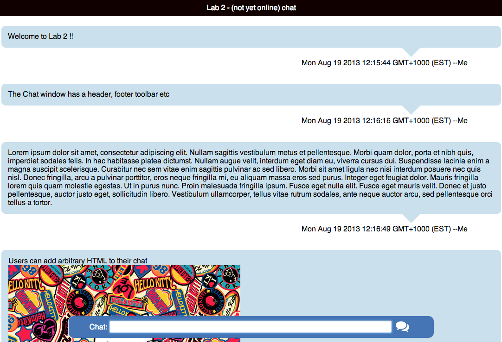
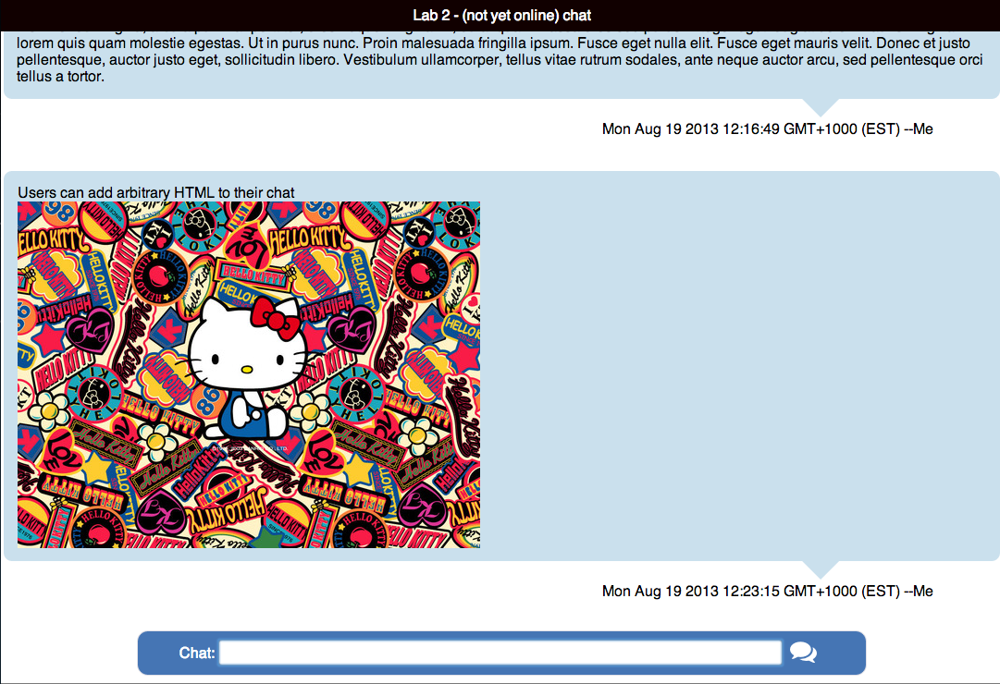

# SWEN90002 - Engineering for Internet Applications
### Lab Week 2
### Group 5
### Oyemike Ebinum - 526250
### Venkatesh Yeluri - 655009

1. 
Since the chat application is browser based, having the ability to post HTML formatted chat allows the user to post creative content and gives them more creative freedom. On the down side, it means that they could be exposed to spam content and potential spam ware.

2. Include in your report some screen shots of your interface working as shown earlier.

	- **Screenshots of Chat Text**
	

   - **Screenshots of Chat text with HTML content**
	
